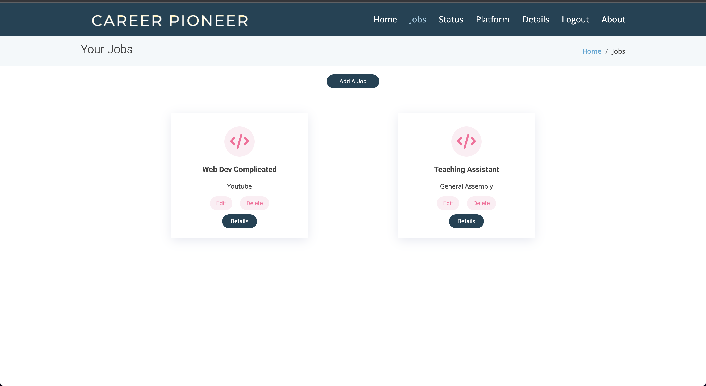

# Career Pioneer
Career Pioneer is a job tracking application for anyone wanting assistance with their job search. Users are able to sign up and start creating jobs that they have applied for or want a saved record to go back to later. Users can create many platforms that they search for jobs on, application statuses, and more advanced job details. All of these fields will be applied to each job you track so you never have to question where you are in the job application process.

---------------

### Getting Started: 
---------
Link to [Trello Board](https://trello.com/b/ENxDm0m5/job-tracker)

[Career Pioneer](https://careerpioneer.herokuapp.com/)

### Screenshots:
----------
Home Page:

Job page:

Add a job page:

Job details page:

### Technologies Used:
-----------
*  (v3.8.9)
* (v4.0)
*  (v14.2)
*  (v5.1)

### Next Steps:
-----------
* An advertisement section will be included for employers to show available jobs
* A calender to keep track of days that progess had been made.
* Users will be able to upload their resume for peer review.